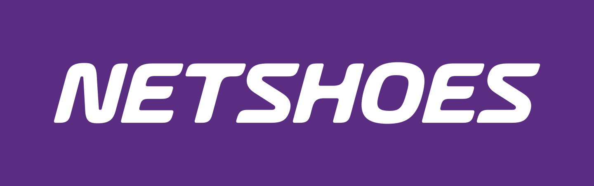

<div align="center">
  
  <h3>Netshoes - API</h3>
</div> 

## Tecnologias Utilizadas

- NodeJS
- Fastify
- Mongodb
- Zod
- Vitest
- Supertest
- NodeCron

## Configuração do Ambiente

Antes de começar, certifique-se de ter o Docker e o Docker Compose instalados na sua máquina.

1. Clone este repositório:

    ```
    git clone https://github.com/hiagopsilva/netshoes-api.git
    ```

2. Navegue até o diretório do projeto:

    ```
    cd netshoes-api
    ```

3. Inicie o contêiner do Docker usando o Docker Compose:

    ```
    docker-compose up --build
    ```

## Funcionalidades

O backend inclui as seguintes funcionalidades:

- Listagem de produtos
- Listagem de favoritos
- Opção de favoritar/desfavoritar o produto
- Testes Funcionais e E2E.
- Persistencia de dados no banco não relacional (mongoDB).
- Um Job que a cada 1h executa uma função que atualiza o banco local com os dados da API externa.

## Testes

Para executar os testes, tenha a API em execução primeiro.

Teste funcional:

    ```
    npm run test

    ou 

    yarn test
    ```

Teste E2E:

    ```
    npm run test:e2e

    ou
    
    yarn test:e2e
    ```

Teste coverage:

    ```
    npm run test:coverage

    ou 

    yarn test:coverage
    ```

Teste UI (Visualização dos testes pela interface):

    ```
    npm run test:ui

    ou 

    yarn test:ui
    ```


### Observãçoes: 

Caso execute a aplicação pelo comando (```yarn dev```), mude o ```host``` do arquivo ```.env``` para ```localhost```.
